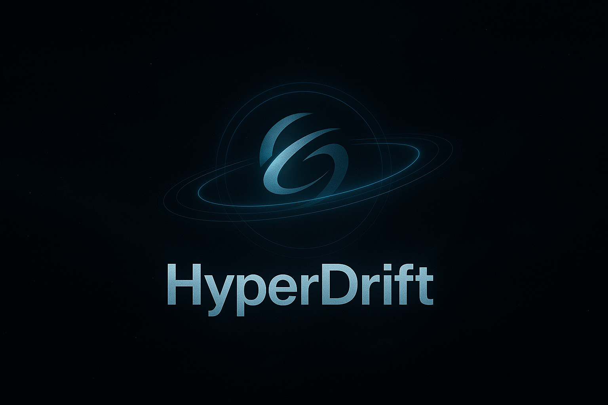

# Hyperdrift - Where Ideas Take Flight

Welcome to **Hyperdrift**! We build tools and systems that push boundaries, optimize workflows, and redefine what's possible.

## What We Do
- **Open-source first**: Our projects are built for the community, by the community.
- **Minimalist design**: Less fluff, more function.

## Why Hyperdrift?
- **Speed**: We move fast and ship faster.
- **Clarity**: No jargon, just results.

## Explore More
Visit [hyperdrift.io](https://hyperdrift.io) to dive deeper into our work. Our [blog](https://hyperdrift.io) features:
- **Insights**: Latest trends, tutorials, and behind-the-scenes stories.
- **Community**: Engage with like-minded developers and innovators. Right now, it's mostly me [yannvr](https://github.com/yannvr) so come on in :)
- **Updates**: Stay ahead with announcements and project highlights.
- Look out for the apps blog to find out more about [apps](https://hyperdrift.io/apps)
